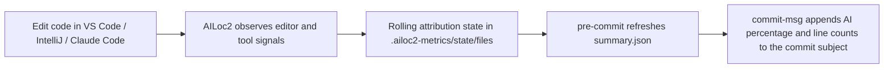

# AILoc2

<p align="center">
  <strong>Local-first AI attribution for real Git commits.</strong><br />
  A VS Code extension + Git hook runtime, now with IntelliJ IDEA and Claude Code companion integrations, that estimates how much of your pending change was AI-assisted and writes the answer where teams actually see it: the commit itself.
</p>

<p align="center">
  
  
  
  
  
</p>

> **Status:** experimental, working prototype. The current VS Code extension appears as `AILoc2 Probe`. It tracks editor activity, persists repo-local attribution state in `.ailoc2-metrics`, refreshes staged and unstaged summaries, and annotates commit messages like `feat: harden hook install flow (AI: 23.47%) (AI lines: 12) (H lines: 39)`.

AILoc2 is built around a practical question most teams cannot answer yet:

**How much of the change I am about to commit looks AI-assisted?**

Not “which entire file once touched an LLM.” Not “what happened in a dashboard three tabs away.” The actual commit. The actual diff. The actual repo.

## Why this project exists

LLM tooling is increasingly woven into normal editing workflows, but Git history still has no native way to express how a change was produced. Whole-file heuristics are noisy, cloud-only tracking is awkward, and wrapper workflows tend to fall apart the moment they meet a real team’s habits.

AILoc2 takes a simpler route:

- observe edits where they actually happen — inside VS Code, IntelliJ IDEA, and Claude Code
- keep attribution artifacts inside the repo
- summarize attribution against staged and unstaged Git diffs
- annotate the commit subject automatically via local Git hooks

No hosted backend is required by this repo. No special commit command to remember. No provenance cosplay.

## What AILoc2 does today

- Watches VS Code document edits, saves, renames, and deletes.
- Records Claude Code `Write`, `Edit`, and `MultiEdit` file mutations through repo-local Claude hooks.
- Correlates workspace-file changes with VS Code chat-editing virtual documents.
- Classifies file changes into AI-leaning and human-leaning signals.
- Persists rolling per-file attribution state in `.ailoc2-metrics/state/files/**/*.metrics.json`.
- Builds staged and unstaged summaries from actual Git diff slices, ignoring whitespace-only diff noise in final percentages and line counts.
- Installs repo-local Git hooks into `.githooks`.
- Annotates commit messages with a suffix like `(AI: 23.47%) (AI lines: 12) (H lines: 39)`.
- Falls back safely to `(AI: unavailable) (AI lines: unavailable) (H lines: unavailable)` when summary data cannot be produced.

## Why it feels different

- **Commit-native** — the headline result lands in the commit message, not a side dashboard.
- **Repo-local** — attribution artifacts are plain JSON written next to the codebase.
- **Change-focused** — percentages are derived from changed lines, not whole-file ownership guesses.
- **Formatting-neutral attribution** — whitespace-only edits are ignored in final percentages and line counts so formatter and linter trivia does not receive AI or Human credit.
- **Auditable** — summaries, rolling state, and manifests are inspectable.
- **Low-friction** — once hooks are installed, the flow feels like normal Git.
- **Hook-friendly** — managed hooks can chain an existing repo-local `core.hooksPath` instead of bulldozing it.

## How it works



At a high level, AILoc2 does four things:

1. **Observe** editor activity in VS Code.
2. **Classify** each file change using human-leaning vs AI-leaning signals.
3. **Persist** rolling attribution state per tracked file.
4. **Summarize** staged and unstaged Git diffs, then annotate the commit message.

## Technical docs

If you want the implementation details rather than the quick-start view, start here:

- [`docs/README.md`](docs/README.md) — technical docs index and source map
- [`docs/architecture.md`](docs/architecture.md) — extension lifecycle, runtime components, and event flow
- [`docs/attribution-and-summary.md`](docs/attribution-and-summary.md) — heuristics, rolling state, save checkpoints, and summary computation
- [`docs/hooks-and-runtime.md`](docs/hooks-and-runtime.md) — hook installation, runtime behavior, CLI usage, and fallback semantics
- [`docs/claude-code.md`](docs/claude-code.md) — Claude Code hook runtime and shared `.ailoc2-metrics` integration

## Quick start

### Prerequisites

- Node.js 18+
- Git
- VS Code `^1.104.3`
- IntelliJ IDEA 2024.1+ and Java 17 for the IntelliJ plugin in [`IntelliJ/`](IntelliJ/)
- Claude Code if you want to record Claude-authored file edits
- A Git repository you can open in VS Code or IntelliJ IDEA

### Run the extension locally

```bash
npm install
npm run build
```

Then open the workspace in VS Code and press `F5` (or use **Run → Start Debugging**) to launch the extension in an Extension Development Host window.

### Install hooks in a target repo

1. Open the Extension Development Host launched by VS Code.
2. Open the Git repository you want to track.
3. Run `AILoc2 Probe: Install Repo Hooks` from the Command Palette.
4. Edit code, save, stage, and commit as usual.

If the target repo already uses a repo-local `core.hooksPath`, AILoc2 can chain to that setup instead of replacing it outright. If `.githooks/pre-commit`, `.githooks/commit-msg`, or `.githooks/post-commit` already exists and is not AILoc2-managed, the installer asks before wrapping it. Approved wrapping preserves the original file as `.githooks/<hook>.ailoc2-delegate`, generates an AILoc2-managed wrapper, and restores the original hook on uninstall. When automatic wrapping is unsafe, AILoc2 prepares `.githooks/migration-package/` with generated AILoc2 hooks, the hook runtime, and Copilot instructions so a follow-up session can chain the generated logic into the existing hooks. The install command also updates `.gitignore` for `.ailoc2-metrics/`, `.githooks/`, and `.claude/`, and installs Claude Code hooks when the Claude runtime bundle is available.

### What you should see

- `AILoc2 Probe` output channel for detailed diagnostics
- `AILoc2 Summary` output channel for summary refreshes
- `.ailoc2-metrics/summary.json` inside the tracked repo
- commit subjects automatically annotated during `git commit`
- post-commit baseline advancement and cleanup so fully committed files start fresh while files with remaining unstaged work keep their attribution
- optional `.ailoc2-metrics/.ignore` rules if you want gitignore-style opt-outs for specific tracked files or directories

### Claude Code companion

The Claude Code runtime is bundled as `out/claude-code/ailoc2-claude-code.cjs`. The normal **Install Repo Hooks** flow installs repo-local `.claude/settings.json` hooks that snapshot files before Claude Code `Write`, `Edit`, and `MultiEdit` operations and record successful edits into the same `.ailoc2-metrics/state/files/**` rolling state used by the VS Code extension.

After `npm run build`, you can also install only the Claude Code hooks into a target repo with:

```bash
node out/claude-code/ailoc2-claude-code.cjs install-claude-hooks C:\path\to\repo out\claude-code\ailoc2-claude-code.cjs
```

See [`docs/claude-code.md`](docs/claude-code.md) for the hook model and failure behavior.

### IntelliJ IDEA plugin prototype

The IntelliJ plugin lives in [`IntelliJ/`](IntelliJ/). It observes IntelliJ editor changes locally, records repo-local metrics under `.ailoc2-metrics/intellij-state`, computes staged AI attribution from `git diff --cached` during IntelliJ commit handling, appends `(AI: xx.xx%) (AI lines: n) (H lines: n)` to the commit subject, and clears fully committed file metrics after successful commits without requiring prompt, instruction, or source-code tag changes.

## Example output

**Commit subject**

> `feat: tighten diff attribution fallback (AI: 23.47%) (AI lines: 12) (H lines: 39)`

**Summary line**

> `my-repo: STAGED -> AI 23.47% | Human 76.53% | AI lines 12 | Human lines 39 | Unknown lines 2 ; UNSTAGED -> AI 0.00% | Human 100.00% | AI lines 0 | Human lines 3 | Unknown lines 0`

## Files AILoc2 creates

```text
your-repo/
├─ .ailoc2-metrics/
│  ├─ manifest.json
│  ├─ .ignore
│  ├─ summary.json
│  ├─ performance.jsonl  # only when AILOC2_PROFILE=1
│  └─ state/
│     ├─ repo-summary.json
│     └─ files/
│        └─ src/
│           └─ example.ts.metrics.json
├─ .githooks/
│  ├─ pre-commit
│  ├─ commit-msg
│  ├─ post-commit
│  └─ ailoc2-hook-runtime.cjs
└─ .claude/
    ├─ settings.json
    └─ ailoc2-claude-code.cjs
```

### What those files mean

- `summary.json` — generated output consumed by hooks and other local tooling.
- `.ignore` — optional gitignore-style rules for files or directories that should never get per-file metrics state.
- `manifest.json` — lightweight bookkeeping and diagnostics for the extension runtime.
- `performance.jsonl` — optional, path-free Git hook phase timings written only when `AILOC2_PROFILE=1`.
- `state/repo-summary.json` — repo baseline state used when recomputing attribution against the current committed content.
- `state/files/**/*.metrics.json` — rolling attribution state per tracked repo file.
- `.githooks/post-commit` — promotes the just-committed index state into the repo baseline and clears fully committed file metrics so later commits score only what remains uncommitted.
- `.githooks/ailoc2-hook-runtime.cjs` — bundled CommonJS runtime used by installed Git hooks.
- `.claude/ailoc2-claude-code.cjs` — optional bundled CommonJS runtime used by Claude Code hooks.

## VS Code commands

| Command | What it does |
| --- | --- |
| `AILoc2 Probe: Show Output` | Opens the detailed probe output channel. |
| `AILoc2 Probe: Log Active Document Snapshot` | Logs a diagnostic snapshot for the active document. |
| `AILoc2 Probe: Log Active Document Metrics Target` | Shows the repo-local metrics target for the active document. |
| `AILoc2 Probe: Show Summary Output` | Opens the summary output channel. |
| `AILoc2 Probe: Recompute Repo Summary` | Rebuilds `.ailoc2-metrics/summary.json` for a selected repo. |
| `AILoc2 Probe: Install Repo Hooks` | Installs managed AILoc2 hooks into `.githooks`. |
| `AILoc2 Probe: Uninstall Repo Hooks` | Removes managed AILoc2 hooks and restores prior repo-local hook settings when possible. |

## Configuration

| Setting | Default | Description |
| --- | --- | --- |
| `ailoc2Probe.logging.verboseOutputChannel` | `false` | When enabled, logs automatic probe events to the `AILoc2 Probe` output channel. |

## Attribution model

The current heuristic is intentionally conservative.

- The **strongest AI signal** is recent `chat-editing-snapshot-text-model` activity followed almost immediately by a workspace-file change — especially a whole-document replacement.
- Large one-shot multi-line insertions or expansions require recent chat-editing context to count as probable AI bulk edits. Size alone is not enough to call a paste AI.
- A **small localized edit** during an active chat-editing session is treated as more likely human than AI to avoid obvious false positives.
- Zero-content change events are filtered out as lifecycle noise.
- Unknown or unattributed slices are kept out of the headline percentage when possible instead of being quietly counted as AI.

### Signals used today

| Signal | Interpretation | Bucket |
| --- | --- | --- |
| `ProbableAIApplyToWorkspaceFile` | Strong evidence of AI apply to a real file after recent snapshot activity. | AI |
| `PossibleAIApplyToWorkspaceFile` | Some AI-like context exists, but the change is less decisive. | AI |
| `ProbableAIBulkWorkspaceEdit` | Large one-shot workspace-file insertion or expansion with recent chat-editing context but without stronger snapshot metadata. | AI |
| `LikelyHumanEditWhileChatSessionOpen` | Small manual edit while a chat session is active. | Human |
| `LikelyHumanOrRegularEditorEdit` | Ordinary workspace-file edit without matching chat-editing context. | Human |

### How the summary is computed

AILoc2 compares rolling attribution state with staged and unstaged Git diff slices. Final percentages ignore whitespace-only diff hunks and weight changed lines by non-whitespace characters only, so formatter and linter whitespace churn is not counted as AI or Human work. The separate line counters count non-blank added lines on the new side of the diff: a modified line counts once, while a pure deletion or blank addition counts zero. Unknown lines are retained in `summary.json` and, for IntelliJ commits, archived commit audits, but are not assigned to AI or Human in the commit subject. Newly added files are scored from file-level attribution magnitudes because line-local spans can be noisy during first-file creation. This simplification currently applies to all tracked file types, including whitespace-significant languages; structural formatter/linter rewrites such as import sorting still count as normal changes.

## Current limitations

This project is already useful, but it is not pretending to be magic.

- Today’s AI detection is heuristic, not universal ground truth.
- The strongest support is for VS Code chat-editing apply flows.
- Edits made outside supported integrations — or while the relevant integration is inactive — are not observed directly at creation time.
- Some AI-assisted changes may still look human or unknown if the editor does not expose a distinct enough signal.
- Large manual paste operations without supported AI-tool context are treated as human edits; ambiguous integrations can still produce unknown or incomplete attribution.
- `(AI: unavailable) (AI lines: unavailable) (H lines: unavailable)` means summary generation, validation, or hook runtime fallback kicked in; it does **not** mean “no AI was used.”
- The extension currently excludes metrics artifact paths such as `.ailoc2-metrics` from tracking to avoid self-feedback loops.
- You can also add repo-local opt-out rules in `.ailoc2-metrics/.ignore`; ignored files or directories do not get per-file metrics state in either plugin.

## Development

```bash
npm install
npm run build
```

Useful scripts:

- `npm run build` — compiles the extension and bundles the hook runtime.
- `npm test` — builds both runtimes and runs the complete Node regression suite.
- `npm run build:hook-runtime` — bundles `out/hook-runtime/ailoc2-hook-runtime.cjs`.
- `npm run build:claude-code-runtime` — bundles `out/claude-code/ailoc2-claude-code.cjs`.
- `npm run watch` — TypeScript watch mode for extension development.

To diagnose slow Git hooks, set `AILOC2_PROFILE=1` in the hook environment and inspect `.ailoc2-metrics/performance.jsonl`. Profiling is disabled by default and never blocks commits.

## Roadmap

- Strengthen provenance by owning more of the AI apply path directly.
- Improve attribution quality for non-chat AI tools and edge-case editing flows.
- Harden diff parsing, save checkpointing, rename handling, and summary validation with tests.
- Improve packaging and distribution so trying AILoc2 feels delightfully boring.
- Add better visualization for teams who want more than a commit suffix.

## Contributing

Issues and pull requests are welcome — especially around attribution accuracy, odd editor behaviors, hook interoperability, and repo-state edge cases. If you can make the heuristics smarter without making the workflow weirder, you are very much in the right place.

---

If Git is the source of truth for code history, AILoc2 is an attempt to make AI provenance part of that truth — locally, visibly, and without asking developers to stop working like developers.
