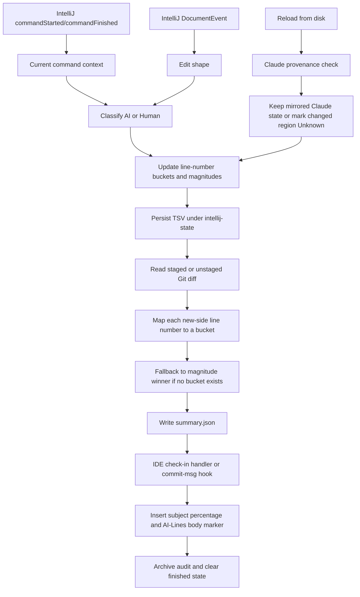

# IntelliJ data collection and commit statistics

This document explains, step by step, how the IntelliJ plugin observes editing activity, classifies it, stores line attribution, reads the Git index, and writes statistics into commit messages.

The IntelliJ implementation is local and heuristic. IntelliJ does not provide this plugin with a universal, authoritative “AI produced this edit” flag. The plugin therefore combines command metadata and edit size. Claude Code is the exception: installed hooks supply explicit provenance for supported file tools and mirror it into IntelliJ state.

For the VS Code implementation, see [VS Code data collection and commit statistics](vscode-data-collection-and-commit-statistics.md). The two extensions produce the same commit annotations but differ materially before that final formatting step.

## What the commit marker means

The plugin appends a percentage to the commit subject and inserts matching counts in the body:

```text
Commit subject (AI: P%)

(AI-Lines: A/T)
```

where:

- `A` is the number of nonblank staged added lines attributed to AI;
- `H` is the number attributed to Human;
- `U` is the number attributed to Unknown;
- `T = A + H + U`.

$$
P=100\times\frac{A}{T}=100\times\frac{A}{A+H+U}
$$

The subject percentage uses at most two decimal places. A `0/0` body marker produces `(AI: 0%)` because no eligible added lines exist.

The marker counts only the new side of the staged diff:

- a modified line counts once;
- a pure deletion contributes no line;
- blank and whitespace-only additions contribute no line;
- Unknown lines are assigned to AI when the summary is generated;
- a deletion-only commit produces `(AI-Lines: 0/0)`.

The staged `aiPercentage` in `.ailoc2-metrics/summary.json` is a separate non-whitespace character-weighted metric:

$$
\text{AI percentage}=100\times\frac{W_{AI}}{W_{AI}+W_{Human}}
$$

New summaries fold Unknown weight and lines into AI. The compatibility Unknown count remains present and is zero.

Primary implementation: [`Ailoc2CommitMessageFormatter.java`](../IntelliJ/src/main/java/com/ailoc2/intellij/Ailoc2CommitMessageFormatter.java), `createAnnotation()` and `apply()`.

## End-to-end flow



## Step 1: start the project-level listeners

At project startup, `Ailoc2ProjectService` registers:

- a project message-bus `CommandListener`;
- a global editor `DocumentListener` scoped to the service lifecycle.

The service starts only once per project. It accepts only documents backed by local, non-directory virtual files.

The document listener is attached to the global editor multicaster by each project-scoped service. If two open IntelliJ projects resolve to the same repository, both services can process the same event; there is no event ID or deduplication check.

Primary implementation: [`Ailoc2ProjectService.java`](../IntelliJ/src/main/java/com/ailoc2/intellij/Ailoc2ProjectService.java), `start()` and `recordDocumentChange()`.

## Step 2: monitor IntelliJ command context

On every command start and finish, the plugin records:

- command name;
- command-group ID text;
- command-group class name;
- a lowercase concatenation of those fields;
- observation time.

While a command is active, its context is used. After it finishes, the context remains eligible for `500 ms`.

The normalized context is searched for these case-insensitive hints:

- `copilot`;
- `codeium`;
- `tabnine`;
- `assistant`;
- `junie`;
- `llm`;
- `ai assistant`;
- `ai completion`;
- `generate code`.

A command named exactly `Undefined` with no group ID or group class is also treated as AI evidence.

The plugin logs each command start and finish to `idea.log`. This helps discover real command patterns, but logging does not improve the score unless the corresponding normalized text matches a rule.

### Signals monitored

| Signal | How it is used |
| --- | --- |
| command name | searched for AI hints; recognizes reload-from-disk command |
| command-group ID | searched for AI hints |
| command-group class | searched for AI hints |
| active command lifetime | links document events occurring during the command |
| most recent command age | keeps context usable for 500 ms after completion |
| exact `Undefined` command with no group | assigns AI |

The implementation does not identify a provider from a stable API. It performs substring matching over presentation and group metadata, which may change across IDE/plugin versions.

Primary implementation: [`Ailoc2ProjectService.java`](../IntelliJ/src/main/java/com/ailoc2/intellij/Ailoc2ProjectService.java), `CommandContext`, `currentCommandContext()`, and `classifyChange()`.

## Step 3: monitor document changes

For each local `DocumentEvent`, the plugin reads:

- file and nearest repository root;
- event offset;
- old and new fragments;
- old and new lengths;
- old/new line-break counts;
- current command context.

The event is accepted only when its nearest Git root is exactly the same as the root derived from the IntelliJ project's base path. This means nested or multiple repositories inside one project are not tracked by this service.

The start line is computed from the current document and event offset. It is one-based because both the persisted model and Git hunk line numbers are one-based.

Primary implementation: [`Ailoc2ProjectService.java`](../IntelliJ/src/main/java/com/ailoc2/intellij/Ailoc2ProjectService.java), `recordDocumentChange()`.

## Step 4: filter paths

During document-event capture, the plugin ignores paths under:

- `.git`;
- `.ailoc2-metrics`;
- `.idea`.

It also honors gitignore-style rules from:

```text
.ailoc2-metrics/.ignore
```

After a path becomes ignored, its cached and persisted state is removed the next time a document event for that path reaches the service. Adding a rule alone does not proactively sweep old TSV files.

Unlike VS Code, IntelliJ does not hard-code every `.gitignore` file as excluded. The Java Git summarizer applies `.ailoc2-metrics/.ignore`, but it does not reapply the document-capture exclusions for `.idea` or `.ailoc2-metrics`. The installed shell hook runtime applies neither exclusion set. Tracked excluded artifacts can therefore affect a summary, and the IDE and terminal-hook summaries can disagree.

Primary implementation: [`Ailoc2ProjectService.java`](../IntelliJ/src/main/java/com/ailoc2/intellij/Ailoc2ProjectService.java), `shouldIgnore()`; [`Ailoc2MetricsIgnoreRules.java`](../IntelliJ/src/main/java/com/ailoc2/intellij/Ailoc2MetricsIgnoreRules.java); and [`Ailoc2Storage.java`](../IntelliJ/src/main/java/com/ailoc2/intellij/Ailoc2Storage.java), `isTrackingIgnored()`.

## Step 5: treat reload-from-disk separately

If the current command name contains `reload from disk`, the plugin reloads state from disk before processing the change.

There are two cases:

1. If the state source is `CLAUDE_CODE` and its timestamp is no more than two minutes old, the plugin assumes the disk reload reflects a Claude edit already recorded by hooks. It does not apply another line change.
2. Otherwise, the changed region is assigned Unknown, source is set to `EXTERNAL`, and state is persisted.

This is the only explicit reconciliation between an external writer and IntelliJ document reloads. Other external-change paths or different command names can bypass it.

Primary implementation: [`Ailoc2ProjectService.java`](../IntelliJ/src/main/java/com/ailoc2/intellij/Ailoc2ProjectService.java), `hasRecentClaudeProvenance()` and the reload branch in `recordDocumentChange()`.

## Step 6: classify ordinary document events

Rules are evaluated in this order:

| Priority | Condition | Bucket | Reason |
| ---: | --- | --- | --- |
| 1 | normalized command context contains an AI hint | AI | `command-context:<hint>` |
| 2 | command is exactly `Undefined` with no group metadata | AI | `undefined-command` |
| 3 | insertion has old length 0, new length greater than 400, and at least 2 logical lines | AI | `bulk-insert` |
| 4 | replacement has old length greater than 0, new length greater than 400, and new length greater than 4 times old length | AI | `bulk-replacement` |
| 5 | any other observed edit | Human | `default-human` |

Unlike VS Code, IntelliJ uses edit size alone as AI evidence. A large manual paste or generator output can therefore be AI even when no AI command was observed.

Conversely, an AI plugin whose command metadata lacks a known hint and whose edit is below the size threshold becomes Human.

Primary implementation: [`Ailoc2ProjectService.java`](../IntelliJ/src/main/java/com/ailoc2/intellij/Ailoc2ProjectService.java), `classifyChange()` and `isBulkMultilineInsertion()`.

## Step 7: update positional line ownership

`Ailoc2FileState` stores a sparse map:

```text
one-based line number -> AI | HUMAN | UNKNOWN
```

For one event it:

1. computes the affected old line interval from the old fragment;
2. removes buckets inside that interval;
3. shifts later buckets by the difference in added and removed line breaks;
4. assigns every resulting line touched by a nonempty new fragment to the event bucket;
5. assigns the surviving start line Unknown for certain partial deletions.

This is positional, not content-aware. It does not compare complete before/after lines or recognize formatter-equivalent content. Formatting, import sorting, refactoring, and line moves can transfer or misalign ownership.

A small edit on an AI line assigns the resulting whole line to Human when the event is default-Human.

Primary implementation: [`Ailoc2FileState.java`](../IntelliJ/src/main/java/com/ailoc2/intellij/Ailoc2FileState.java), `applyLineChange()`.

## Step 8: accumulate fallback magnitudes

Each ordinary event adds:

$$
M=\max(\text{old fragment length},\text{new fragment length},1)
$$

to either cumulative AI or cumulative Human magnitude. Java fragment length is measured in Java character units and includes whitespace.

Magnitudes only increase. Undo does not subtract prior evidence; redo does not restore the original bucket. Undo and redo are usually classified as ordinary Human commands unless their context matches an AI rule.

If a Git-added line has no explicit positional bucket, fallback chooses one bucket for the whole missing line:

- both magnitudes zero: Unknown;
- AI magnitude greater than or equal to Human magnitude: AI;
- otherwise: Human.

An exact tie therefore becomes AI. This winner-take-all fallback differs from VS Code's proportional allocation.

Primary implementation: [`Ailoc2FileState.java`](../IntelliJ/src/main/java/com/ailoc2/intellij/Ailoc2FileState.java), `addMagnitude()` and `fallbackBucket()`.

## Step 9: persist IntelliJ rolling state

Each file is written as TSV under:

```text
.ailoc2-metrics/intellij-state/<sanitized-path>.tsv
```

The state includes:

- source, normally `INTELLIJ`, `EXTERNAL`, or mirrored `CLAUDE_CODE`;
- recorded timestamp;
- AI magnitude;
- Human magnitude;
- each explicit line-number bucket.

The path is flattened by replacing every character outside `[A-Za-z0-9._-]` with `_`. This can collide: distinct paths can map to the same TSV filename.

Writes are direct `Files.writeString()` operations. Write errors are silently ignored to avoid interrupting editing. There is no temporary-file swap, file lock, generation check, or durable event log.

The cache uses a `ConcurrentHashMap`, but the mutable `Ailoc2FileState` and file update are not transactionally protected across threads or processes. IntelliJ and Claude mirroring can race.

Primary implementation: [`Ailoc2Storage.java`](../IntelliJ/src/main/java/com/ailoc2/intellij/Ailoc2Storage.java), `persistState()`, `readState()`, and `safeStateFileName()`.

## Step 10: incorporate Claude Code provenance

The IntelliJ installer can deploy the shared Claude runtime and hooks for `Write`, `Edit`, `MultiEdit`, and Bash commands with explicit output redirection destinations.

The Node runtime:

1. captures before-text in `PreToolUse`;
2. records successful before/after changes as AI in canonical VS Code JSON state;
3. overlays the resulting line attribution into the IntelliJ TSV format—AI and Human spans are copied, while a canonical Unknown line preserves an existing IntelliJ bucket at that line when present;
4. sets source to `CLAUDE_CODE` and a timestamp.

The two-minute reload check prevents the normal IntelliJ reload-from-disk path from immediately overwriting that mirrored attribution.

This is explicit tool provenance and is stronger evidence than IntelliJ command-name or size heuristics.

Primary implementation: [`Ailoc2HookManager.java`](../IntelliJ/src/main/java/com/ailoc2/intellij/Ailoc2HookManager.java), Claude hook installation; and [`src/integrations/claudeCode/metrics.ts`](../src/integrations/claudeCode/metrics.ts), `mirrorClaudeAttributionForIntellij()`.

## Step 11: read Git diffs

The Java service computes:

- staged summary from `git diff --cached --unified=0 --find-renames --no-color --ignore-all-space`;
- unstaged summary from the corresponding non-cached command.

The terminal hook runtime separately parses the staged diff using shell and AWK.

Important boundaries:

- the Java unstaged summary does not add untracked files;
- the commit marker is based on staged content;
- `--ignore-all-space` omits whitespace-only hunks, including potentially meaningful indentation;
- deleted files have `+++ /dev/null` and contribute no added lines;
- path parsing is line-oriented and does not fully decode Git-quoted unusual filenames.

Primary implementation: [`Ailoc2ProjectService.java`](../IntelliJ/src/main/java/com/ailoc2/intellij/Ailoc2ProjectService.java), `refreshStagedSummary()` and `refreshRepoSummary()`; [`Ailoc2HookManager.java`](../IntelliJ/src/main/java/com/ailoc2/intellij/Ailoc2HookManager.java), generated `refresh_summary()`.

## Step 12: map staged added lines to state

`Ailoc2GitDiffSummarizer` processes zero-context unified diff text:

1. read the current new-side path from `+++`;
2. read the new-side starting line from each hunk header;
3. for every `+` content line, look up the current one-based line bucket;
4. if no bucket exists, use the file's magnitude winner;
5. count the non-whitespace code points in the added text;
6. ignore a line when that weight is zero;
7. add the weight and one line to Human only for a Human bucket; AI, Unknown, and missing attribution are assigned to AI.

Exact positional buckets therefore determine both the line count and weighted percentage when available.

The crucial limitation is that state is intended to represent the **latest observed working document**, not a saved version matched to the staged index blob. The TSV stores no document version, content hash, or blob OID, so missed or out-of-band edits can leave it stale. If a staged line is edited again without staging the later change, the latest bucket can be applied to older staged content.

Primary implementation: [`Ailoc2GitDiffSummarizer.java`](../IntelliJ/src/main/java/com/ailoc2/intellij/Ailoc2GitDiffSummarizer.java), `summarize()`.

## Step 13: write `summary.json`

The summary is stored at:

```text
.ailoc2-metrics/summary.json
```

It contains:

- availability;
- changed and attributed file counts;
- AI and Human weights;
- AI and Human added-line counts, plus a compatibility Unknown count set to zero;
- AI and Human percentages;
- per-file AI/Human weights;
- staged and, for Java-triggered full refreshes, unstaged slices.

Java writes the file directly and ignores I/O errors. The generated terminal runtime also writes directly.

Primary implementation: [`Ailoc2Storage.java`](../IntelliJ/src/main/java/com/ailoc2/intellij/Ailoc2Storage.java), `writeSummary()`.

## Step 14: annotate commits through either IntelliJ or Git hooks

There are two commit paths.

### IntelliJ check-in handler

Before check-in, it:

1. resolves the repository from the project base path;
2. recomputes `git diff --cached`;
3. copies the summary to `commit-audits/pending.json`;
4. replaces the commit-panel message with an idempotently formatted message.

After a successful check-in, it archives the pending audit by commit hash, clears state for fully committed files, preserves paths with unstaged/untracked work, and refreshes the summary.

The handler receives the commit panel's selected changes but does not inspect them. It summarizes the physical Git index. In IntelliJ workflows where selected changes are not exactly represented in the index yet, the panel annotation may describe a different set.

Primary implementation: [`Ailoc2CheckinHandlerFactory.java`](../IntelliJ/src/main/java/com/ailoc2/intellij/Ailoc2CheckinHandlerFactory.java).

### Managed Git hooks

Installed hooks run for terminal and external commits:

1. `pre-commit` refreshes the staged summary and pending audit;
2. `commit-msg` refreshes again, reads counts, and inserts the marker;
3. `post-commit` archives the audit, removes state for committed paths without leftovers, and refreshes the summary.

Recomputation in `commit-msg` captures files staged by delegated pre-commit hooks. Failures should not block commits; the fallback annotations are `(AI: unavailable)` in the subject and `(AI-Lines: unavailable)` in the body.

The generated shell runtime reproduces Java logic rather than invoking the Java implementation. This creates drift risks, including missing `.ignore` support and platform-dependent AWK character/locale behavior.

Primary implementation: [`Ailoc2HookManager.java`](../IntelliJ/src/main/java/com/ailoc2/intellij/Ailoc2HookManager.java), generated hook scripts and `createManagedRuntimeScript()`.

## What is logged but not retained as scoring evidence

`idea.log` receives:

- command start and finish context;
- changed repository and file;
- selected bucket and reason;
- event offset;
- old and new lengths;
- old and new line counts;
- touched line count.

Durable TSV state retains only source, timestamp, two magnitudes, and current line buckets. Command names, reasons, edit fragments, and event IDs are not journaled, so a classification cannot be reconstructed after the fact.

## Data-quality and correctness gaps

| Priority | Gap | How it can affect commit statistics |
| ---: | --- | --- |
| Critical | current working-tree line buckets are applied directly to staged content | later unstaged edits can relabel earlier staged lines |
| Critical | IntelliJ check-in handler ignores selected changes and reads the index | panel marker can describe the index rather than the actual selected commit set |
| Critical | platform state is separate from VS Code canonical state | ordinary edits from one IDE are invisible to the other; whichever hook annotates last wins |
| High | project-scoped services attach listeners to a global editor multicaster | two open projects resolving to the same repository can process one event twice |
| High | broad command substring matching | unrelated commands containing `assistant`, `llm`, or another hint can become AI |
| High | exact undefined-command heuristic | ordinary plugin/editor operations exposed as undefined can become AI |
| High | edit size alone assigns AI | manual paste, formatter, refactor, or generated boilerplate can inflate AI |
| High | absent AI evidence defaults to Human | unsupported assistants and automation can inflate Human |
| High | positional line map is not content-aware | formatting, refactors, moves, and a one-character correction can transfer whole-line ownership |
| High | magnitude fallback is winner-take-all and ties favor AI | missing buckets can exaggerate the majority and convert a tie to AI |
| High | state filenames can collide | unrelated files can read or overwrite the same attribution state |
| High | writes are silent, direct, and unlocked | failures or concurrent IntelliJ/Claude writers can lose or corrupt state |
| High | terminal runtime ignores `.ailoc2-metrics/.ignore` | IDE and terminal commits can produce different counts |
| High | unusual Git paths are not fully decoded | Unicode/quoted/tab-containing paths can miss their state and become Unknown |
| High | shell pipeline does not portably detect upstream Git failure | a failed diff may become a valid-looking zero summary and `(AI-Lines: 0/0)` |
| Medium | undo/redo do not reverse provenance | cumulative fallback retains undone work and redo may become Human |
| Medium | no VFS rename/delete listener | renamed files lose state continuity; old state remains stale |
| Medium | no content hash or blob checkpoint | restart/out-of-band changes can leave stale positional ownership |
| Medium | untracked files are absent from unstaged Java summary | VS Code and IntelliJ on-demand summaries disagree before staging |
| Medium | only the project-base repository is tracked | nested and multi-root repositories are ignored |
| Medium | generated shell and Java implementations duplicate logic | behavior can drift as one path is fixed without the other |
| Medium | raw classification events are not durable | there is no replay, deduplication, source audit, or schema migration path |
| Medium | root/merge commit cleanup uses simple `diff-tree HEAD` | committed state can remain stale for some commit topologies |

## Signals currently missing

The IntelliJ implementation does not directly monitor or positively identify:

- inline-completion acceptance;
- stable provider/model identity;
- clipboard paste versus typing;
- formatter, linter, refactoring, code-action, or generator provenance;
- VFS rename, delete, and copy operations;
- staged blob identity or save checkpoints;
- selected changes in the IntelliJ commit panel;
- checkout, reset, rebase, merge, and branch-switch lifecycle;
- semantic line moves and mixed authorship within one line;
- edits made before plugin startup;
- nested repositories outside the single project-base root;
- untracked files in the unstaged summary;
- external tools other than supported Claude hooks.

## Recommended improvements

The highest-value improvements are:

1. store checkpoints keyed by Git blob OID and score staged content against the matching version;
2. use the IntelliJ commit panel's actual selected changes or defer authoritative annotation to the final Git index;
3. replace broad command-name hints with explicit integrations or empirically verified command IDs;
4. do not use edit size alone as definitive AI provenance; classify it as uncertain;
5. default unsupported/ambiguous provenance to Unknown rather than Human;
6. use content-aware line or token diffing instead of only positional shifts;
7. use proportional fallback and keep exact ties Unknown;
8. use collision-resistant path encoding while preserving repository-relative hierarchy;
9. make state writes atomic, locked, validated, and observable on failure;
10. unify Java and terminal summary logic behind one runtime or shared golden tests;
11. apply identical `.ignore` and built-in exclusions in Java, shell, Claude, and VS Code paths;
12. add VFS lifecycle listeners and reconcile external changes through content hashes;
13. persist a bounded event journal with source, confidence, event ID, command ID, and before/after blob identity;
14. use NUL-safe Git parsing and verify pipeline exit status;
15. define which extension owns hooks when both IDEs are used in one repository, or merge both state formats explicitly.

## Interpretation guidance

Treat `(AI: P%)` and `(AI-Lines: A/T)` as estimates based on the staged added lines that the current IntelliJ state can classify.

Confidence is strongest when:

- Claude Code hooks recorded a successful supported tool operation;
- the staged content has not changed relative to the latest document state observed by the plugin;
- explicit line buckets exist for the staged new-side lines.

Confidence is weaker when:

- attribution comes from a command-name hint or size threshold;
- fallback magnitudes choose the bucket;
- a file was partially staged, reformatted, renamed, moved, or externally modified;
- the commit uses IntelliJ selected changes that differ from the physical index;
- Unknown lines or an unavailable marker are present.
