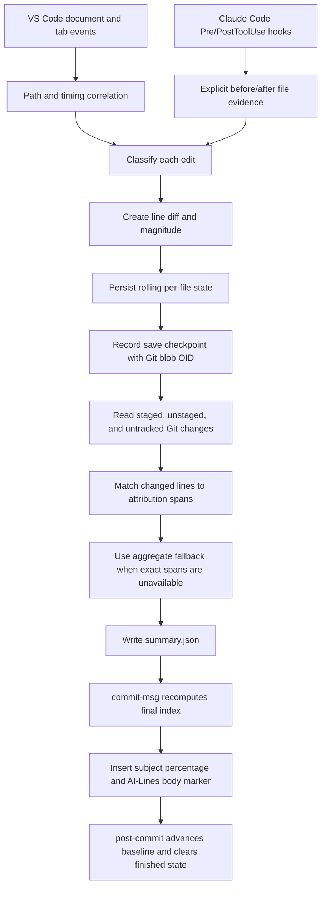

# VS Code data collection and commit statistics

This document explains, step by step, how the VS Code extension observes editing activity, turns observations into file-level attribution state, intersects that state with Git changes, and writes statistics into commit messages.

The important limitation to keep in mind is that native VS Code chat attribution is **heuristic**. The extension observes timing and edit-shape signals; it does not receive a definitive author label from VS Code. Claude Code is different: its installed hooks provide explicit tool provenance for supported file-edit operations.

For the IntelliJ implementation, see [IntelliJ data collection and commit statistics](intellij-data-collection-and-commit-statistics.md). The two extensions produce the same commit annotations, but they do not gather or retain evidence in the same way.

## What the commit marker means

The extension appends a percentage to the commit subject and inserts matching counts in the body:

```text
Commit subject (AI: P%)

(AI-Lines: A/T)
```

where:

- `A` is the number of eligible, nonblank **added lines** attributed to AI;
- `H` is the number attributed to Human;
- `U` is the number whose attribution is Unknown;
- `T = A + H + U`.

Therefore:

$$
P=100\times\frac{A}{T}=100\times\frac{A}{A+H+U}
$$

The subject percentage uses at most two decimal places. A `0/0` body marker produces `(AI: 0%)` because no eligible added lines exist.

This is not a count of all changed lines:

- a modified line counts once, on the new side of the diff;
- a removed line contributes no line to the marker;
- a pure deletion produces `(AI-Lines: 0/0)`;
- blank and whitespace-only additions do not count;
- unresolved lines are assigned to AI, so new summaries write `unknownAddedLineCount: 0`.

The `aiPercentage` shown in `.ailoc2-metrics/summary.json` uses the same nonblank added-line counts:

$$
	ext{AI percentage}=100\times\frac{A}{A+H+U}
$$

New summaries fold Unknown weight and lines into AI. The compatibility Unknown count remains present and is zero. Character weights remain available in `aiWeightedChangedLines` and `humanWeightedChangedLines` as diagnostic data, but they do not affect the displayed percentages.

Primary implementation: [`src/hooks/commitMessage.ts`](../src/hooks/commitMessage.ts), `createAiLinesAnnotation()` and `applyAiLinesAnnotationToCommitMessage()`.

## End-to-end flow



## Step 1: initialize temporary tracking state

At activation, the extension creates in-memory structures for:

- the latest full-text snapshot of each open document;
- recent chat-editing context, keyed by normalized target path;
- recent `willSave` context;
- a random extension-session ID;
- repository queues for durable metric updates.

Already-open documents are snapshotted and existing tabs are scanned for chat-editing resources. A snapshot contains the text, a short SHA-256 hash, character length, line count, document version, and capture time.

The text snapshot is necessary because a VS Code change event contains the changed fragments, not a durable copy of the complete prior document. Comparing the previous and current snapshots lets AILoc2 rebuild line-level changes.

This state is process-local. A crash before queued data is flushed can lose recent observations.

Primary implementation: [`src/extension.ts`](../src/extension.ts), `activate()`, `createSnapshot()`, and `summarizeSnapshot()`.

## Step 2: monitor native VS Code chat-editing signals

The extension recognizes these internal URI schemes:

- `chat-editing-text-model`;
- `chat-editing-snapshot-text-model`.

It observes them through:

- document-open events;
- document-change events;
- an initial scan of open tabs;
- tab-group change events, which rescan the tabs.

A virtual chat document is mapped to the corresponding real file using candidate paths from the document filename, URI path fields, scheme-stripped filename, and query metadata.

### Chat metadata monitored

The extension records the following short-lived correlation metadata when available:

| Signal | Purpose in the captured event | Used directly to classify authorship? |
| --- | --- | --- |
| normalized target file path | correlates virtual chat activity to the workspace file | **Yes** |
| latest chat activity time | establishes whether chat context is recent | **Yes** |
| latest snapshot activity time | establishes stronger apply evidence | **Yes** |
| virtual-document scheme | distinguishes ordinary and snapshot models | **Yes**, through snapshot recency |
| request IDs and snapshot request IDs | diagnostic correlation | No |
| document ID and edit kind | diagnostic correlation | No |
| undo-stop metadata | diagnostic correlation | No |
| chat session URI details | diagnostic correlation | No |
| last event name and virtual URI | diagnostic correlation | No |

Classification currently relies on matching path and time, not on matching request or session IDs.

### Correlation windows

- ordinary chat context remains recent for `120000 ms`;
- snapshot activity is strong evidence for `1500 ms`;
- `willSave` context can correlate with `didSave` for `5000 ms`.

These are heuristics, not protocol guarantees.

Primary implementation: [`src/chatEditingUri.ts`](../src/chatEditingUri.ts) and [`src/extension.ts`](../src/extension.ts), `rememberChatEditContextFromMetadata()`, `scanTabsForChatEditingContext()`, and `getRecentChatEditCorrelation()`.

## Step 3: monitor real workspace-file changes

For every eligible `onDidChangeTextDocument` event, the extension:

1. retrieves the previous full-document snapshot;
2. creates the new snapshot;
3. looks up recent chat context for the logical path;
4. totals inserted and removed content across all changes in the event;
5. recognizes the event shape;
6. classifies it;
7. creates whole-file line-diff segments;
8. decides whether the event may be persisted.

### Edit-shape signals monitored

Let:

- $I$ be the total inserted character length;
- $R$ be the total replaced or removed character length.

The extension detects:

| Shape | Current rule |
| --- | --- |
| no-op/lifecycle event | zero content changes |
| whole-document replacement | one change replaces the complete previous text and inserts nonempty text |
| small localized edit | one non-whole-file change with $I\leq8$ and $R\leq8$ |
| bulk insertion | $R=0$, $I\geq400$, and at least 8 inserted logical lines |
| bulk expansion | $R>0$, $I\geq400$, at least 8 inserted lines, and $I\geq4R$ |

The event also records a replacement ratio:

$$
\text{replacementRatio}=\frac{\max(I,R)}{\max(\text{previous file length},I,R)}
$$

That ratio is retained in the transient metric event but does not affect rolling aggregation or the final commit score.

Primary implementation: [`src/extension.ts`](../src/extension.ts), `computeChangeStats()` and `classifyChangeEvent()`.

## Step 4: classify the event

Workspace-file rules are evaluated in this order:

| Priority | Condition | Signal | Stored bucket |
| ---: | --- | --- | --- |
| 1 | no content changes | `LifecycleNoiseOrDirtyStateFlip` | not persisted |
| 2 | recent snapshot and whole-document replacement | `ProbableAIApplyToWorkspaceFile` | AI |
| 3 | recent chat context and small localized edit | `LikelyHumanEditWhileChatSessionOpen` | Human |
| 4 | recent snapshot, but neither rule above | `PossibleAIApplyToWorkspaceFile` | AI |
| 5 | recent chat context and bulk insertion/expansion | `ProbableAIBulkWorkspaceEdit` | AI |
| 6 | any other workspace edit | `LikelyHumanOrRegularEditorEdit` | Human |

Two interpretations are essential:

1. `PossibleAIApplyToWorkspaceFile` receives full AI credit even though its name expresses uncertainty.
2. `LikelyHumanOrRegularEditorEdit` means “no recognized AI evidence,” not “a human was positively identified.”

A large paste without recent chat evidence remains Human/regular. Size alone is not an AI signal in the VS Code implementation.

Primary implementation: [`src/changeClassification.ts`](../src/changeClassification.ts) and [`src/metrics/schema.ts`](../src/metrics/schema.ts), `getAttributionBucketForSignal()`.

## Step 5: filter events before durable storage

A VS Code edit is persisted only when all of these are true:

- it belongs to a local `file:` document;
- the document is not untitled;
- it is not lifecycle noise;
- a Git repository root can be resolved;
- the path is not a built-in tracking exclusion;
- the path is not ignored by `.ailoc2-metrics/.ignore` when the queue is flushed.

Built-in exclusions include:

- `.ailoc2-metrics` and the legacy `.ailoc-metrics` directory;
- every file named `.gitignore`.

`.ailoc2-metrics/.ignore` supports gitignore-like rules, including negation. It prevents queued rolling-state persistence and summary participation, but currently does **not** prevent the extension from taking in-memory snapshots or creating verbose diagnostic previews before flush. Adding a rule does not proactively sweep inactive state files; an affected path is removed when it later enters a store operation. Claude pre-tool snapshots also bypass this check and can remain durable after failed or skipped calls.

The Claude path does not apply the native capture path's built-in `.gitignore` and metrics-directory exclusions before recording. Those paths are filtered from later Git summaries, but state or a pending snapshot can already have been written.

Repository discovery searches upward, but it stops at a containing VS Code workspace-folder boundary. Opening only a nested directory of a larger Git repository can therefore prevent repository resolution.

Primary implementation: [`src/trackingExclusions.ts`](../src/trackingExclusions.ts), [`src/metrics/ignore.ts`](../src/metrics/ignore.ts), and [`src/metrics/repoResolver.ts`](../src/metrics/repoResolver.ts).

## Step 6: convert an edit into line attribution

The previous and current complete texts are split into logical lines and compared. Every resulting segment is one of:

- `equal`: retain the prior attribution;
- `removed`: delete those lines from the current line model;
- `added`: give the new lines the current event's AI, Human, or Unknown bucket.

The durable line model is run-length encoded, for example:

```json
[
  { "attribution": "Human", "lineCount": 20 },
  { "attribution": "AI", "lineCount": 5 },
  { "attribution": "Unknown", "lineCount": 1 }
]
```

### Formatter-neutral comparison

For equality matching, all whitespace is removed. TypeScript and JavaScript also normalize quote delimiters and trailing semicolons/commas.

The goal is to prevent formatter-only changes from stealing authorship. This has a serious trade-off: whitespace inside strings and indentation in whitespace-significant languages can also be ignored even when semantically meaningful.

Attribution is line-level, not token-level. A one-character Human correction to an AI line can make the complete resulting line Human.

Primary implementation: [`src/metrics/lineDiff.ts`](../src/metrics/lineDiff.ts) and [`src/metrics/store.ts`](../src/metrics/store.ts), `applyLineDiffSegmentsToRollingState()`.

## Step 7: accumulate rolling state

Each tracked file has durable JSON state at:

```text
.ailoc2-metrics/state/files/<repo-relative-path>.metrics.json
```

The state retains:

- latest signal;
- event counters per signal;
- cumulative AI change magnitude;
- cumulative Human change magnitude;
- current line-attribution spans;
- up to 64 save checkpoints;
- deletion timestamp.

For a normal event, attribution-relevant magnitude is:

$$
M=\sum \text{non-whitespace weight of added segments}
 +\sum \text{non-whitespace weight of removed segments}
$$

The complete $M$ is added to either AI or Human according to the categorical event signal. Equal segments contribute zero. Magnitudes only increase; undo and redo are not applied as inverse operations.

Signal counters count qualifying edit events, not lines or characters.

Writes are coalesced for `350 ms` per repository. Ordering is maintained inside one `RepoMetricsStore` instance, but not across separate processes or extension windows.

Primary implementation: [`src/metrics/store.ts`](../src/metrics/store.ts), `applyWorkspaceMetricToRollingState()` and `getAttributionRelevantChangeMagnitude()`.

## Step 8: record save checkpoints

A save queues a checkpoint update. During flush, Git attempts to compute the blob OID of the working-tree file. A checkpoint stores:

- that Git blob OID, or `null` when hashing fails;
- cumulative AI and Human magnitudes at the time;
- a copy of the line-attribution spans.

When a later staged index blob matches a non-null checkpoint OID, the summary can connect the exact saved bytes to historical spans even if the working tree has subsequently changed. A save-only batch is skipped when no rolling state exists, so not every save produces a checkpoint.

Only the newest 64 checkpoints are retained.

Primary implementation: [`src/extension.ts`](../src/extension.ts), save listeners; [`src/metrics/git.ts`](../src/metrics/git.ts); and [`src/metrics/store.ts`](../src/metrics/store.ts), `applySaveUpdateToRollingState()`.

## Step 9: preserve file lifecycle where possible

The extension listens for workspace rename and delete events.

- A same-repository rename moves the state to the new path.
- A cross-repository rename moves state and emits source/destination lifecycle records.
- A delete marks the file deleted and clears current line spans while preserving historical magnitudes and checkpoints.

This provides structural continuity, but it does not preserve semantic ownership through arbitrary copies, generated replacements, or complex refactors.

Primary implementation: [`src/extension.ts`](../src/extension.ts), rename/delete handlers, and [`src/metrics/store.ts`](../src/metrics/store.ts), `moveRollingState()` and `markDeleted()`.

## Step 10: incorporate explicit Claude Code provenance

When Claude Code integration is installed, AILoc2 registers hooks for `Write`, `Edit`, `MultiEdit`, and `Bash`. Bash attribution is limited to commands with an explicit output redirection destination:

1. `PreToolUse` stores the complete prior file text under `.ailoc2-metrics/claude-code/pending`.
2. `PostToolUse` ignores known failed tool calls.
3. It reads the resulting file and computes before/after line segments.
4. It requests an AI metric update and save checkpoint.
5. It removes the pending snapshot after the recording call returns. Because store flush failures are swallowed, this does not prove that the update became durable.
6. It overlays canonical line attribution into IntelliJ's TSV state so IntelliJ-installed hooks can consume Claude provenance. AI and Human spans are copied; a canonical Unknown line preserves an existing IntelliJ bucket at that line when present.

`Edit`, `MultiEdit`, or Bash output redirection without a prior snapshot is skipped. `Write` without a prior snapshot assumes empty prior content, which can over-attribute an existing file if the pre-hook failed.

This path is stronger than VS Code chat correlation because the tool invocation explicitly identifies a supported file operation.

Primary implementation: [`src/integrations/claudeCode/runtime.ts`](../src/integrations/claudeCode/runtime.ts) and [`src/integrations/claudeCode/metrics.ts`](../src/integrations/claudeCode/metrics.ts).

## Step 11: read the Git changes that will be summarized

Summary generation reads three sets:

1. staged tracked changes with `git diff --cached --unified=0 --find-renames --no-color --ignore-all-space`;
2. unstaged tracked changes with the corresponding non-cached diff;
3. untracked files from `git ls-files --others --exclude-standard`.

For tracked diffs, AILoc2 extracts new-side hunk ranges and counts nonblank added lines. For untracked files, the entire file is treated as new-side content.

Git's `--ignore-all-space` makes the final summary formatting-neutral, but can also hide meaningful whitespace changes in Python, YAML, string literals, and other whitespace-sensitive content.

Primary implementation: [`src/metrics/summary.ts`](../src/metrics/summary.ts), `parseGitDiffEntries()` and Git-entry collection helpers.

## Step 12: attribute each Git slice

For an existing staged file, the preferred process is:

1. obtain the staged index blob OID;
2. find a matching save checkpoint;
3. use that checkpoint's line spans for the staged hunk ranges.

If no checkpoint matches, current rolling spans may still be used when the file has no detected unstaged diff and the staged content can be read. This is less version-explicit than an OID match but avoids unnecessary aggregate fallback for a fully staged file.

For unstaged changes, current line spans are used against working-tree line ranges.

For every nonblank new-side hunk line:

- AI span: increment `A` and add its non-whitespace length to $W_{AI}$;
- Human span: increment `H` and add its weight to $W_{Human}$;
- Unknown span: increment `A` and add its non-whitespace length to $W_{AI}$.

If exact line-local state cannot be used, the first file-level fallback derives AI and Human ratios from cumulative magnitude after subtracting the repository baseline:

$$
r_{AI}=\frac{M_{AI}}{M_{AI}+M_{Human}},\qquad
r_{Human}=\frac{M_{Human}}{M_{AI}+M_{Human}}
$$

Changed content and integer added-line counts are allocated by these ratios. Any unresolved integer remainder, including an exact tie, is assigned to AI.

When both baseline-subtracted magnitudes are zero, fallback uses all-time AI/Human signal-event counts. If those are also zero, it uses the latest signal.

New files always use aggregate attribution rather than current line spans. A historical repair heuristic forces the aggregate to fully AI when AI and Human magnitudes are both positive, at least one AI signal exists, AI magnitude is at least twice Human magnitude, and an older checkpoint has zero cumulative AI magnitude plus at least 400 cumulative Human magnitude. This may also erase legitimate Human contribution when its thresholds happen to match.

Primary implementation: [`src/metrics/summary.ts`](../src/metrics/summary.ts), `summarizeDiffSlices()`, `deriveChangedLineAttributionFromSpans()`, `applyDiffSliceContribution()`, and `allocateAddedLineCounts()`.

## Step 13: write the repository summary

The result is stored at:

```text
.ailoc2-metrics/summary.json
```

For staged and unstaged slices it includes:

- changed-file count;
- attributed-file count;
- AI and Human weighted changed content;
- AI and Human added-line counts, plus a compatibility `unknownAddedLineCount` field set to `0`;
- AI and Human percentages;
- the current `usedFallbackAttribution` implementation flag.

That flag is not a fully reliable audit indicator. Unknown exact spans can set it even though their resulting weight and lines are assigned to AI, while some aggregate paths—including normal new-file aggregation—can leave it unset.

Missing state does not automatically make the summary unavailable. Eligible additions without attribution are counted as AI.

## Step 14: recompute at commit time

Managed hooks use three phases:

1. `pre-commit` prepares a baseline for the current index and refreshes the summary.
2. `commit-msg` repeats both operations and then annotates the message. This second calculation captures formatter, linter, generator, or delegated-hook changes staged after `pre-commit` began.
3. `post-commit` promotes the prepared baseline, clears fully committed file state, retains files with unstaged leftovers, removes the pending baseline, and refreshes the summary. Unlike IntelliJ, this path does not archive a per-commit audit file.

The hooks fail open: attribution errors should not block a commit. When valid counts are unavailable, the subject suffix becomes `(AI: unavailable)` and the body marker becomes `(AI-Lines: unavailable)` where the fallback path can write them.

Primary implementation: [`src/hooks/management.ts`](../src/hooks/management.ts), [`src/cli/gitHookCli.ts`](../src/cli/gitHookCli.ts), and [`src/metrics/summary.ts`](../src/metrics/summary.ts).

## Signals that are measured but do not affect the score

The following fields are useful for diagnostics, but are discarded or ignored by the rolling-state calculation:

- replacement ratio;
- short before/after hashes;
- document version and dirty flag;
- classification explanation;
- Undo/Redo reason;
- save-correlation metadata;
- request IDs, session details, document IDs, edit kinds, and undo stops;
- editor selections and visible ranges;
- session-boundary reason.

This is not automatically wrong, but collecting metadata that cannot be used for attribution, deduplication, or later audit increases complexity and can create a false impression of stronger causality than the implementation has.

## Data-quality and correctness gaps

These are current implementation risks, not hypothetical product requirements.

| Priority | Gap | How it can affect commit statistics |
| ---: | --- | --- |
| Critical | no repository-wide lock or event deduplication | VS Code, Claude hooks, multiple windows, or IntelliJ mirroring can overwrite or double-apply state |
| Critical | failed flushes are logged and swallowed after records leave the queue | attribution can be permanently lost while callers appear successful |
| High | queued writes wait up to 350 ms | an immediate stage/commit can read stale durable state and assign unresolved lines to AI |
| High | tab rescans refresh timestamps for existing chat tabs | unrelated tab activity can manufacture fresh AI evidence without a new AI apply |
| High | native chat causality is only path plus time | unrelated edits in the timing window can be AI; delayed AI applies can be missed |
| High | weak and strong AI signals collapse into one AI bucket | `PossibleAI...` receives the same credit as explicit Claude provenance |
| High | no-evidence edits default to Human | unsupported AI tools, paste operations, and external automation can inflate Human attribution |
| High | gross churn only increases | edit/undo/redo and repeated rewrites can be counted multiple times in fallback magnitudes |
| High | whitespace is removed without language awareness | behavior-changing indentation or whitespace inside literals can preserve old attribution and contribute zero |
| High | partial staging needs an exact retained save checkpoint | without one, whole-file fallback can mix committed and uncommitted authorship |
| High | exact and fallback paths use different weighting bases | the same Git change can influence percentages differently depending on checkpoint availability |
| High | unresolved attribution defaults to AI | missing state or explicit Unknown spans can inflate AI attribution |
| High | `usedFallbackAttribution` is not authoritative | Unknown exact content can set it while some aggregate attribution paths leave it unset |
| High | new-file repair can force Human evidence to AI | a historical repair threshold can hide real mixed authorship |
| High | Claude `Write` without a snapshot assumes an empty file | a failed pre-hook on an existing file can make all resulting content AI |
| Medium | line ownership is not token ownership | a one-character edit can transfer the whole line to the latest bucket |
| Medium | raw events are not durably journaled | decisions cannot be replayed, deduplicated, or audited after aggregation |
| Medium | pending Claude snapshots contain source text without TTL cleanup | failed/skipped invocations can retain plaintext indefinitely |
| Medium | `.ignore` filters storage, not observation | ignored source can still enter snapshots and verbose diagnostics |
| Medium | root/merge commit cleanup and unusual Git paths are fragile | stale state or fallback AI attribution can remain for affected commits |
| Medium | Git output has a fixed buffer and parsing is not fully NUL-safe | large diffs or unusual filenames can make summaries unavailable or incomplete |

## Signals currently missing

The VS Code implementation does not directly monitor or positively identify:

- inline-completion acceptance;
- AI provider or model identity;
- typing versus clipboard paste;
- formatter, linter, code-action, or refactoring provenance;
- generated-file provenance;
- unsupported AI assistants and external agents;
- shell/editor changes other than supported Claude hooks;
- checkout, reset, rebase, merge, and branch-switch lifecycle;
- notebook-cell and non-`file:` remote document edits;
- edits made before extension activation;
- semantic moves or mixed Human/AI content within one line.

When an edit is observed without an AI signal it usually becomes Human. When a Git addition was not observed at all it becomes AI under the unresolved-attribution policy. That difference should be considered when interpreting the marker.

## Recommended improvements

The highest-value improvements are:

1. serialize all writers with a repository-wide lock or compare-and-swap generation;
2. retain failed records and propagate flush failure;
3. persist event IDs and reject replayed tool invocations;
4. keep a bounded append-only evidence journal with source, confidence, before/after OIDs, and timestamps;
5. separate explicit provenance, heuristic confidence, and final attribution bucket;
6. stop tab discovery from refreshing activity timestamps;
7. use request/session identity when the platform exposes stable identifiers;
8. default unsupported or ambiguous provenance to Unknown rather than Human;
9. make whitespace equivalence language- and token-aware;
10. model net surviving contribution and Undo/Redo rather than gross churn;
11. support token/range attribution for mixed-authorship lines;
12. reconcile index content for partial staging without requiring an exact whole-file checkpoint;
13. reconcile Claude disk edits with VS Code reload events to prevent duplicate observation;
14. apply privacy exclusions before snapshots and diagnostic logging;
15. use NUL-safe Git parsing and consistent weighting for exact and fallback paths.

## Interpretation guidance

Treat `(AI: P%)` and `(AI-Lines: A/T)` as local estimates of the staged added lines that AILoc2 could classify—not as proof of authorship.

Confidence is strongest when:

- Claude Code hooks captured a successful supported edit with before/after content;
- a staged blob matches a save checkpoint;
- changed lines map directly to retained attribution spans.

Confidence is weaker when:

- attribution comes from recent native chat timing alone;
- aggregate fallback is used;
- the file is new, partially staged, heavily reformatted, moved, or edited by multiple tools;
- Unknown lines or an unavailable marker are present.
